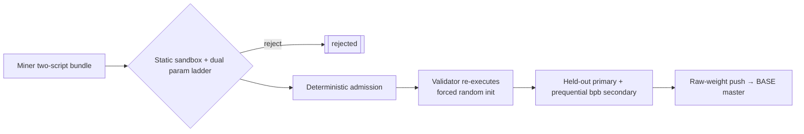

<div align="center">

# PRISM

**Research lab subnet — try new architectures; find more performant ones under fair challenge-owned re-exec.**

<a href="docs/overview.md">Overview</a> ·
<a href="docs/miner/README.md">Miners</a> ·
<a href="docs/validator/README.md">Validators</a> ·
<a href="docs/architecture.md">Architecture</a> ·
<a href="docs/scoring.md">Scoring</a> ·
<a href="docs/security.md">Security</a>

[](LICENSE)
[](https://bittensor.com/)
[](https://github.com/BaseIntelligence/base/releases/tag/v3.1.2)


</div>

---

## Overview

PRISM is a [BASE](https://joinbase.ai) **research lab** challenge. The **norm** is to try **new
architectures**. The **goal** is to find architectures that are **more performant** for our LLM
target: generalization after from-scratch learning on locked data, under fair challenge-owned
re-execution (not paper claims alone).

Miners submit a **two-script** bundle — `architecture.py` (`build_model(ctx)`) and `training.py`
(`train(ctx)`) — and the challenge owns everything else: a locked **FineWeb-Edu** dataset
(read-only, no network) and the score. **The miner owns** the model and the training loop; the
challenge owns the data and the metric.

Every scored run is re-executed under a **forced random init**. Scoring is **deterministic** (no
LLM gateway). Raw weights push to BASE for master aggregation; validators fetch the final vector and
call `set_weights` under their own hotkeys. PRISM never writes on-chain weights.

### Base SDK pin

PRISM depends on the immutable Base public wheel:

```text
https://github.com/BaseIntelligence/base/releases/download/v3.1.2/base-3.1.2-py3-none-any.whl
#sha256=3a61c2d3a343ed6de55e80215486e3de0c9639276443d08f2ed316bc807f2ff0
```

(see `pyproject.toml`). There is no LLM gateway dependency in this pin.

## Research lab, small-first ladder

GPU is limited, so the lab proves ideas on a **small-first ladder** before promoting:

| Stage | Param cap | Emission role |
| --- | ---: | --- |
| **Explore / provisional** | **124M** (`124_000_000`) | Continuous discovery; may hold a **provisional crown** |
| **Promote / final** | **350M** (`350_000_000`) | Same package/family pin re-eval; **confirms or revokes** the provisional crown |

Default exploration shapes under the 124M explore cap are the tracked lab seeds
[`examples/tiny-1m`](examples/tiny-1m) (`transformer-tiny-1m`) and
[`examples/mamba-tiny`](examples/mamba-tiny) (`mamba-tiny-1m`). Novel `nn.Module` families under the
AST sandbox remain first-class (Transformer, looped depth, pure-torch SSM, LightDeepLoop-class
ideas).

## Emission vs scientific surfaces

Two graded surfaces stay honest and separate:

| Surface | What it ranks | Primary / secondary |
| --- | --- | --- |
| **Emission crown** (leaderboard → raw weights) | Subnet reward eligibility | **Held-out / generalization primary**, prequential bpb **secondary** (Official-like) |
| **Official Comparison / multimetric / Complete View** | Published **scientific miner architecture grade** | Multi-axis held-out + bpb + long-ctx + reasoning + polar honesty (`TIE_POLAR`) |

Multimetric scorecard `multimetric.v1.1` and Complete View (`complete_view.v1.2` /
`complete_view.v1.3`) are **published research grade**. They do **not** silently replace the
emission scalar in v1.

Two-tier ownership defaults are architecture **0.50** / training **0.50** (both use the emission
rank metric).

## How It Works



1. **Submit** — a signed `architecture.py` + `training.py` bundle (a single combined module is rejected).
2. **Static gates** — AST sandbox, dual param ladder (124M explore / 350M promote), single-node multi-GPU contract; any failure is terminal before GPU.
3. **Deterministic admission** — challenge-owned checks only; the former LLM gateway hard gate is removed.
4. **Forced-init re-execution** — one validator re-runs the loop on the locked FineWeb-Edu train split and captures the online loss itself (miner-reported numbers are ignored).
5. **Emission scoring** — held-out / generalization **primary**, recomputed prequential bits-per-byte **secondary**, plus memorization / step-0 fail-closed gates.
6. **Weights** — emission splits two-tier (best architecture `0.50` / best training variant `0.50`); provisional crowns may form at 124M and must be confirmed or revoked at 350M promote. Raw weights push to BASE master aggregation; validators submit on-chain (or a fake chain in tests).

## Anti-Cheat By Construction

Common cheats are **inert**, not merely detected:

- **No pretrained weights** — forced random init makes smuggled weights inert; an anomalous step-0 loss zeroes the score; the container runs `network=none`.
- **No metric gaming** — the challenge recomputes the metric from the loss it captured; miner-reported numbers and manifests are ignored.
- **No memorization** — the secret `val`/`test` splits never leave the master; an excessive train-vs-held-out gap is penalized.
- **Deterministic** — fixed seeds and a challenge-controlled data order reproduce the same score within tolerance.

## TEE Verifier

PRISM includes a **Prism-only, fail-closed local TEE fixture verifier** for unit and contract tests.
Real Lium/Targon remote attestation that would produce a production PASS is **blocked** until those
provider readiness gates are satisfied. Local fixture verification does not imply live TEE production
readiness on Lium or Targon. Lab GPU scores and image pin checks never unlock **REAL-PROVIDER TEE PASS**.

## Worker Plane (optional)

PRISM can move GPU re-execution onto **miner-funded workers** (deployed on Lium/Targon via the BASE
`base worker` CLI). Validators then run verify-only plausibility checks plus probabilistic audits,
and each result carries an `ExecutionProof` (manifest hash + worker sr25519 signature, with optional
image-digest and attestation tiers). Gated behind `worker_plane` (default off). See the
<a href="https://github.com/BaseIntelligence/base/blob/main/docs/miner/worker-plane.md">worker deployment guide</a>.

## Documentation

| Guide | Contents |
|-------|----------|
| <a href="docs/overview.md">Overview</a> | Research-lab identity, ladder, emission vs science |
| <a href="docs/miner/README.md">Miner guide</a> | Build and submit a two-script bundle; tiny-1m / mamba-tiny seeds |
| <a href="docs/validator/README.md">Validator guide</a> | Run evaluation on your own broker |
| <a href="docs/architecture.md">Architecture</a> | Service design and forced-init re-execution |
| <a href="docs/submissions.md">Submission format</a> | Two-script contract, dual ladder, `PrismContext` |
| <a href="docs/scoring.md">Scoring & rewards</a> | Emission held-out primary + bpb secondary; two-tier 0.50/0.50 |
| <a href="docs/official-comparison.md">Official Comparison</a> | Scientific multi-axis grade (not emission scalar) + multimetric / Complete View |
| <a href="docs/scaling.md">Scaling</a> | Single-node multi-GPU contract |
| <a href="docs/security.md">Security model</a> | Sandbox, deterministic admission, anti-cheat |
| <a href="docs/api.md">API</a> | Internal and public routes |
| <a href="docs/operators.md">Operators</a> | Deploy and run under BASE Compose |

## Development

```bash
uv run ruff check .
uv run mypy
uv run pytest --cov=prism_challenge --cov-fail-under=80
```

GPU re-execution, HuggingFace publication, and external provider calls are mocked in tests; real GPU
and provider keys are wired only at deploy. The LLM gateway is not part of the test or deploy path.

## License

Apache-2.0
