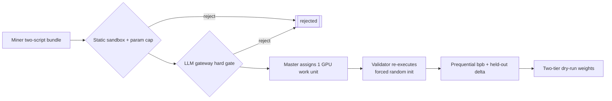

<div align="center">

# PRISM

**An "ability to learn" ML challenge — two-script submissions, locked data, challenge-owned scoring.**

<a href="docs/overview.md">Overview</a> ·
<a href="docs/miner/README.md">Miners</a> ·
<a href="docs/validator/README.md">Validators</a> ·
<a href="docs/architecture.md">Architecture</a> ·
<a href="docs/scoring.md">Scoring</a> ·
<a href="docs/security.md">Security</a>

[](LICENSE)
[](https://bittensor.com/)
[](https://joinbase.ai)


</div>

---

## Overview

PRISM is a [BASE](https://joinbase.ai) subnet that measures a model's **ability to learn** from
scratch. Miners submit a **two-script** bundle — `architecture.py` (`build_model(ctx)`) and
`training.py` (`train(ctx)`) — and the challenge owns everything else: a locked **FineWeb-Edu**
dataset (read-only, no network) and the scoring. **The miner owns** the model and the training loop;
the challenge owns the data and the score.

Every scored run is re-executed by the challenge under a **forced random init**, so the score is a
**prequential** (online) compression metric in **bits-per-byte** — the area under the from-scratch
loss curve, normalized by bytes consumed. Weights are derived from those scores through the
**LLM gateway**-gated pipeline and published **dry-run**. Faster learning ⇒ better compression ⇒
better score.

## How It Works



1. **Submit** — a signed `architecture.py` + `training.py` bundle (a single combined module is rejected).
2. **Static gates** — AST sandbox, 150M parameter cap, single-node multi-GPU contract; any failure is terminal before GPU.
3. **LLM hard gate** — a strong model reviews both scripts via the master gateway; a `reject` is terminal.
4. **Forced-init re-execution** — one validator re-runs the loop on the locked FineWeb-Edu train split and captures the online loss itself (miner-reported numbers are ignored).
5. **Scoring** — the master computes prequential bits-per-byte plus a secret held-out delta tie-breaker.
6. **Weights** — emission splits two-tier (best architecture `0.60` / best training variant `0.40`), published dry-run via `get_weights` (never on-chain here).

## Anti-Cheat By Construction

Common cheats are **inert**, not merely detected:

- **No pretrained weights** — forced random init makes smuggled weights inert; an anomalous step-0 loss zeroes the score; the container runs `network=none`.
- **No metric gaming** — the challenge recomputes the metric from the loss it captured; miner-reported numbers and manifests are ignored.
- **No memorization** — the secret `val`/`test` splits never leave the master; an excessive train-vs-held-out gap is penalized.
- **Deterministic** — fixed seeds and a challenge-controlled data order reproduce the same score within tolerance.

## Worker Plane (optional)

PRISM can move GPU re-execution onto **miner-funded workers** (deployed on Lium/Targon via the BASE
`base worker` CLI). Validators then run verify-only plausibility checks plus probabilistic audits,
and each result carries an `ExecutionProof` (manifest hash + worker sr25519 signature, with optional
image-digest and attestation tiers). Gated behind `worker_plane` (default off). See the
<a href="https://github.com/BaseIntelligence/base/blob/main/docs/miner/worker-plane.md">worker deployment guide</a>.

## Documentation

| Guide | Contents |
|-------|----------|
| <a href="docs/overview.md">Overview</a> | The subnet in one page |
| <a href="docs/miner/README.md">Miner guide</a> | Build and submit a two-script bundle |
| <a href="docs/validator/README.md">Validator guide</a> | Run evaluation on your own broker |
| <a href="docs/architecture.md">Architecture</a> | Service design and forced-init re-execution |
| <a href="docs/submissions.md">Submission format</a> | The two-script contract and `PrismContext` |
| <a href="docs/scoring.md">Scoring &amp; rewards</a> | Prequential bits-per-byte and tie-breakers |
| <a href="docs/scaling.md">Scaling</a> | Single-node multi-GPU contract |
| <a href="docs/security.md">Security model</a> | Sandbox, LLM gate, anti-cheat |
| <a href="docs/api.md">API</a> | Internal and public routes |
| <a href="docs/operators.md">Operators</a> | Deploy and run |

## Development

```bash
uv run ruff check .
uv run mypy
uv run pytest --cov=prism_challenge --cov-fail-under=80
```

GPU re-execution, HuggingFace publication, and LLM provider calls are mocked in tests; the real GPU,
HuggingFace token, and provider keys are wired only at deploy.

## License

Apache-2.0
