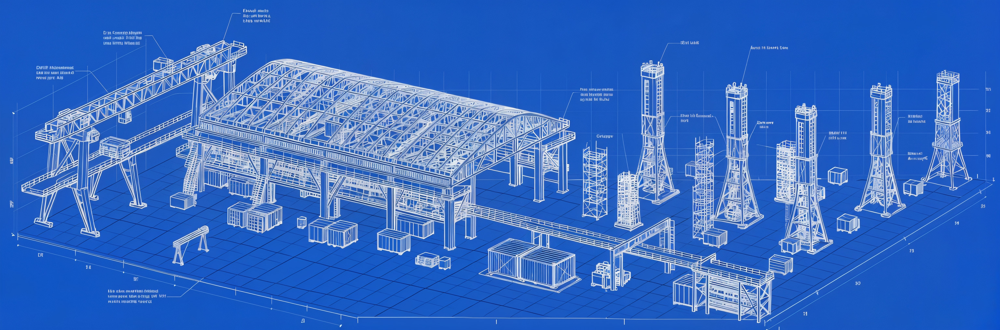

<div align="center">

# PRISM

**Miner guide for the BASE prism challenge — HTTP recipe submit.**

[](https://github.com/BaseIntelligence/base)
[](https://bittensor.com/)
[](LICENSE)



[Overview](docs/README.md) ·
[Getting started](docs/getting-started.md) ·
[Submit](docs/submit.md) ·
[Scoring & competition](docs/scoring.md) ·
[API](docs/api.md) ·
[Examples](examples/baseline/)

</div>

## What it is

PRISM is a research challenge: you try **new architectures** and the challenge re-executes
them fairly. You submit **two Python scripts** — `architecture.py` (`build_model(ctx)`) and
`training.py` (`train(model, ctx)`) — and the operator runs them on a GPU pod against a
pinned FineWeb-Edu shard. Score is pure **bits-per-byte** (bpb, lower is better) measured
by the operator harness. There is **no** miner Docker image, no CVM, no on-chain write from
miners — HTTP submit only.

| | |
|---|---|
| Challenge id | `prism` |
| Production gateway | `https://chain.joinbase.ai` |
| Staging gateway | `http://staging.api.joinbase.ai` |
| Submit path | `/challenge/prism/v1/submissions` |
| Recipe | v1.3.0 — telemetry hooks required; source-tree ZIPs + v3 battery (shadow) |

**v3 (shadow-by-default):** recipe 1.3.0 runs your submission through a two-phase pod
flow (train → operator-staged private eval assets → eval) and measures it on the
**G1–G8 battery** (intrinsic fit, downstream, recall, reasoning, long-context, sample
efficiency, inference efficiency, stability) alongside the usual bpb. The leaf score is
still pure bpb until governance flips composite scoring on — see
[Scoring & competition](docs/scoring.md). Your `train()` return dict is a labelled,
never-scored **Zone B** self-report; additional reports can be posted to
`POST /v1/submissions/{id}/zone-b`. You may now also submit **full source trees**
(with custom `kernels/`) instead of only two scripts — see [Submit](docs/submit.md).

This repository holds **miner documentation and examples only**. Control-plane source
lives in [BaseIntelligence/base](https://github.com/BaseIntelligence/base).

## Start here

1. Read [Getting started](docs/getting-started.md).
2. Copy [`examples/baseline/`](examples/baseline/) — it shows the required telemetry
   hooks (`prism_telemetry.report` + `finish_evaluation`).
3. Zip `architecture.py` + `training.py` and submit — see [Submit](docs/submit.md).
4. Poll events until `terminated`, then check your bpb — see [API](docs/api.md).

```bash
export GATEWAY=https://chain.joinbase.ai
export HOTKEY=<64 lowercase hex>   # public hotkey only — never a secret key

cd examples/baseline
zip -j submission.zip architecture.py training.py

curl -sS -X POST "$GATEWAY/challenge/prism/v1/submissions" \
  -H 'content-type: application/zip' \
  -H "X-Miner-Hotkey: $HOTKEY" \
  --data-binary @submission.zip
```

## The three things miners get wrong

1. **Missing telemetry hooks** — `training.py` must import `prism_telemetry` and call
   `report(...)` during training (and may call `finish_evaluation()` to stop early).
   Missing hooks = hard contract violation, zero score, terminal.
2. **Copying someone's `architecture.py`** — the pre-GPU copy gate rejects byte/AST
   copies of *earlier* architectures with zero score, no appeal. Starting from the
   published baseline is fine.
3. **Submitting again while gated** — one accepted architecture submission per hotkey;
   a second one returns `409 submission_gated`. Training-only entries on published
   architectures are separate slots (one per `(hotkey, arch_id)`).
