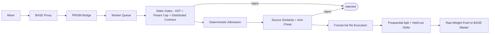
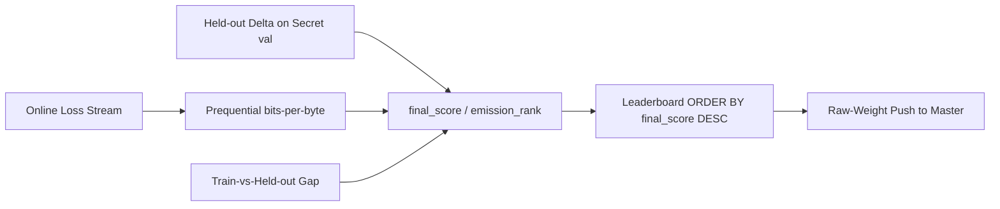

# Architecture

PRISM is a BASE challenge service: a FastAPI application with SQLite state, internal BASE
authentication, and GPU evaluation through the BASE Docker broker (or optional external worker-plane
evaluation on trusted Lium/Targon providers). It measures a model's ability to learn: miners submit
two scripts, the challenge owns the data and the evaluation, and scored runs are re-executed under a
forced random init so the challenge computes the score itself.

PRISM pins the immutable Base SDK wheel **v3.1.2** (see the root README and `pyproject.toml`). There
is **no LLM gateway** dependency, client, route, or admission path.

## Pipeline



## Main Components

| Component | Responsibility |
| --- | --- |
| FastAPI app | Public and internal HTTP routes; optional **combined mode** drains the eval queue in-process |
| Repository | SQLite persistence for submissions, scores, sources, eval jobs, and GPU leases |
| Worker | Claims submissions, runs static + deterministic admission, dispatches re-execution, finalizes scores |
| Component resolver | Resolves the two-script contract (`architecture.py`/`build_model` + `training.py`/`train`) and fingerprints it |
| Static sandbox | AST hard-blocks, the forced-seed parameter-cap instantiation, and the multi-GPU static contract |
| Deterministic admission | Challenge-owned checks only: project shape, sandbox, similarity, anti-cheat; no LLM hard gate |
| Source similarity | Exact-hash and borderline-similarity checks; quarantine band is a **terminal reject** (never held) |
| Container runner | Challenge-owned forced-init re-execution that captures the online loss stream |
| External-result ingest | Accepts **only** `ExternalResultEnvelope` on the worker-plane result route (fail closed on legacy bodies) |
| Provider trust + IMAGE_PIN | Trusts Lium/Targon providers; `pinned_image_digest` → audit effective tier 0/1 (max 1); no TEE verifier |
| Scoring | Emission rank: held-out / generalization primary, prequential bpb secondary, anti-memorization gap |
| Raw-weight push | Pushes authenticated raw hotkey weights to the BASE master for aggregation |

## BASE Integration

BASE owns miner-facing upload security (signatures, timestamps, nonces, hotkey identity) before
forwarding a submission to `POST /internal/v1/bridge/submissions`. The bridge trusts only internal BASE
authentication and the verified hotkey header; miner-supplied identity headers are not trusted.

PRISM depends on the published Base `challenge_sdk` contracts (auth, schemas, app factory, health,
version, `ExternalResultEnvelope`). The pin is:

```text
https://github.com/BaseIntelligence/base/releases/download/v3.1.2/base-3.1.2-py3-none-any.whl
#sha256=3a61c2d3a343ed6de55e80215486e3de0c9639276443d08f2ed316bc807f2ff0
```

## Compose Deployment Model

Supported install is **Docker Compose only** (single host). In the master Compose project, PRISM runs
as **one long-lived combined challenge service** (`combined_mode`): the API process also drains the
eval queue in-process (no second app/DB, no Swarm, no application-launched ephemeral evaluator jobs).
Challenge-owned state stays on the challenge volume. See the BASE operator Compose docs
(`deploy/compose/*`) for install and the digest-aware watcher.

## Execution Model

PRISM never executes miner code in the API process without isolation. The worker runs static
inspection and deterministic admission, then ships the project to an isolated container (or accepts a
reconciled external result when the worker plane is enabled):

```text
PRISM worker -> DockerExecutor -> BASE Docker broker -> GPU evaluator container
```

When the **worker plane** is enabled, GPU re-execution may land on miner-funded external workers; the
BASE master reconciles replicas and forwards a single accepted result as an `ExternalResultEnvelope`.
Legacy reduced bodies without `api_version`, assignment/challenge bindings, and proof fail closed
before scoring or persistence.

The pre-GPU static gates run in order; a rejection at any of them is terminal before similarity
admission and before any GPU work:

1. AST sandbox hard-blocks over both scripts.
2. Forced-seed `build_model` instantiation and the dual param ladder (124M explore / 350M promote).
3. The multi-GPU static contract and single-node bound.
4. Deterministic source similarity (exact duplicate and quarantine band → **rejected**, never held).

Legacy local-CPU (except explicit test mode) and remote-Lium execution paths for the default scored
mode are not the supported operator path. See [Submissions](submissions.md) for the two-script
contract and [Scaling](scaling.md) for the multi-GPU rules.

## Forced-Init Re-Execution (Anti-Cheat Core)

The challenge harness drives every scored run; miner code only supplies the model and the loop body.

1. **Forced init.** A challenge-owned runner imports the miner's `architecture.py` and `training.py`,
   sets the global seeds and deterministic flags (`torch.manual_seed`, `cuda.manual_seed_all`,
   `use_deterministic_algorithms(True)`, cudnn deterministic) **before** any miner code runs, then
   launches `torchrun --standalone --nnodes=1 --nproc-per-node=1` with `MASTER_ADDR=127.0.0.1`.
2. **Online-loss capture.** The data iterator yields fresh, single-pass batches from the read-only
   locked `train` split in a challenge-controlled order, and the challenge records the per-batch loss
   **before** the optimizer updates on it. Single-pass data makes this the prequential code-length by
   construction.
3. **Manifest.** The challenge authors `prism_run_manifest.v2.json` from the captured stream; any
   miner-written manifest or reported metric is discarded.

The eval container is non-root, has a read-only rootfs except `artifacts_dir`, uses `network=none`, and
is bounded by a wall-clock budget that is only a safety cap, never part of the score.

## Provider Trust And IMAGE_PIN Boundary

Prism does **not** ship a TEE verifier and does **not** gate production score finalization on TEE
evidence. Operators trust **Lium/Targon** as GPU providers. Ordinary ExecutionProof envelopes and
signatures remain; **IMAGE_PIN** (`worker_plane.pinned_image_digest`) may grant effective tier **1**
on digest match and downgrades on mismatch. Max effective tier is **1** (no TEE tier-2 elevation).
Legacy claim fields such as `tdx_quote_b64` / `gpu_eat_jwt`, if present on the wire, are inert and
never elevate tier. **REAL-PROVIDER TEE** is a **retired** Prism product goal (historical lab tables
may still record BLOCKED). See [Security](security.md).

## State Model

State lives in SQLite. Key tables include `miners`, `submissions`, `eval_jobs`, `gpu_leases`,
`scores`, `submission_sources`, `epochs`, plus raw-weight push ledger state. TEE nonce / decision
ledgers are not created by the current product path.

- `eval_jobs` tracks each attempt (including the `level='l1'` static-tracking placeholder, which is not
  GPU work).
- `gpu_leases` records the exclusive single-GPU lease for a scored run.
- `scores` holds the challenge-computed prequential bits-per-byte `final_score` and its metrics.
- Legacy LLM review / hold tables are not written by the admission path; forward migrations reject
  leftover held/quarantined rows without approving them.

## Scoring Flow

Once the re-execution produces a valid challenge-authored `prism_run_manifest.v2.json`, scoring derives
everything from the challenge-owned capture:



The emission primary axis is held-out / generalization (higher heldout_delta → better `final_score`);
prequential bits-per-byte is secondary (lower bpb breaks near-ties on primary only). The
train-vs-held-out gap penalizes memorization, and a step-0 anomaly multiplier zeroes a
smuggled-weights run. Worker-plane `skip_heldout` degrades without inventing held-out and cannot
advance emission crowns. The leaderboard orders by `final_score` with an earliest-commit-wins
tie-break. PRISM pushes authenticated raw hotkey weights to the BASE master; validators fetch the
master vector and call `set_weights` with their own wallets. PRISM never writes weights on-chain.

## Failure Handling

A submission ends `pending`, `running`, `completed`, `failed`, or `rejected`:

- **rejected** — failed static review, the two-script contract, deterministic similarity/anti-cheat, or
  other admission gates;
- **failed** — passed the gates but failed the re-execution, scoring, or infrastructure.

There is **no** production `held` status and no operator hold-resolution / LLM review surface after
gateway removal. Similarity quarantine is terminal reject. Legacy stuck hold rows are migrated to
reject, never silently approved.
