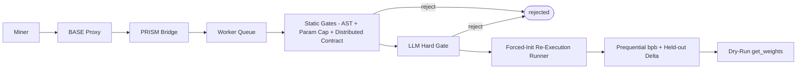
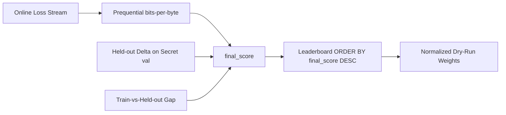

# Architecture

PRISM is a BASE challenge service: a FastAPI application with SQLite state, internal BASE
authentication, and GPU evaluation through the BASE Docker broker. It measures a model's ability to
learn: miners submit two scripts, the challenge owns the data and the evaluation, and the validator
re-executes the miner's training loop under a forced random init and computes the score itself.

## Pipeline



## Main Components

| Component | Responsibility |
| --- | --- |
| FastAPI app | Public and internal HTTP routes |
| Repository | SQLite persistence for submissions, scores, sources, eval jobs, and GPU leases |
| Worker | Claims submissions, runs static + LLM gates, dispatches re-execution, finalizes scores |
| Component resolver | Resolves the two-script contract (`architecture.py`/`build_model` + `training.py`/`train`) and fingerprints it |
| Static sandbox | AST hard-blocks, the forced-seed parameter-cap instantiation, and the multi-GPU static contract |
| LLM hard gate | Master-gateway LLM review of both scripts; a `reject` is terminal before any GPU work |
| Container runner | Challenge-owned forced-init re-execution that captures the online loss stream |
| Scoring | Prequential bits-per-byte plus the held-out delta tie-breaker and anti-memorization gap |
| Weights module | Converts normalized completed scores into dry-run BASE weights |

## BASE Integration

BASE owns miner-facing upload security (signatures, timestamps, nonces, hotkey identity) before
forwarding a submission to `POST /internal/v1/bridge/submissions`. The bridge trusts only internal BASE
authentication and the verified hotkey header; miner-supplied identity headers are not trusted.

## Execution Model

PRISM never executes miner code in the master process. The worker runs static inspection and the LLM
hard gate, then ships the project to an isolated evaluator container:

```text
PRISM worker -> DockerExecutor -> BASE Docker broker -> GPU evaluator container
```

The pre-GPU static gates run in order, and a rejection at any of them is terminal before the LLM review
and before any GPU work:

1. AST sandbox hard-blocks over both scripts.
2. Forced-seed `build_model` instantiation and the 150M parameter cap.
3. The multi-GPU static contract and single-node bound.

Legacy local-CPU and remote-Lium execution paths are not supported. See [Submissions](submissions.md)
for the two-script contract and [Scaling](scaling.md) for the multi-GPU rules.

## Forced-Init Re-Execution (Anti-Cheat Core)

The challenge harness drives every scored run; miner code only supplies the model and the loop body.

1. **Forced init.** A challenge-owned runner imports the miner's `architecture.py` and `training.py`,
   sets the global seeds and deterministic flags (`torch.manual_seed`, `cuda.manual_seed_all`,
   `use_deterministic_algorithms(True)`, cudnn deterministic) **before** any miner code runs, then
   launches `torchrun --standalone --nnodes=1 --nproc-per-node=1` with `MASTER_ADDR=127.0.0.1`.
2. **Online-loss capture.** The data iterator yields fresh, single-pass batches from the read-only
   locked `train` split in a challenge-controlled order, and the challenge records the per-batch loss
   **before** the optimizer updates on it. Single-pass data makes this the prequential code-length by
   construction.
3. **Manifest.** The challenge authors `prism_run_manifest.v2.json` from the captured stream; any
   miner-written manifest or reported metric is discarded.

The eval container is non-root, has a read-only rootfs except `artifacts_dir`, uses `network=none`, and
is bounded by a wall-clock budget that is only a safety cap, never part of the score.

## State Model

State lives in SQLite. Key tables: `miners`, `submissions`, `eval_jobs`, `gpu_leases`, `scores`,
`submission_sources`, `llm_reviews`, `plagiarism_reviews`, `epochs`.

- `eval_jobs` tracks each attempt (including the `level='l1'` static-tracking placeholder, which is not
  GPU work).
- `gpu_leases` records the exclusive single-GPU lease for a scored run.
- `scores` holds the challenge-computed prequential bits-per-byte `final_score` and its metrics.

## Scoring Flow

Once the re-execution produces a valid challenge-authored `prism_run_manifest.v2.json`, scoring derives
everything from the challenge-owned capture:



The primary axis is the prequential bits-per-byte (lower bpb → better `final_score`); the held-out delta
refines near-ties only, the train-vs-held-out gap penalizes memorization, and a step-0 anomaly
multiplier zeroes a smuggled-weights run. The leaderboard orders by `final_score` with an
earliest-commit-wins tie-break, and `get_weights` returns one normalized, dry-run weight per hotkey
(best per hotkey), never written on-chain.

## Failure Handling

A submission ends `pending`, `running`, `completed`, `failed`, `rejected`, or `held`:

- **rejected** — failed static review, the two-script contract, the LLM hard gate, or duplicate review;
- **failed** — passed the gates but failed the re-execution, scoring, or infrastructure;
- **held** — quarantined by the LLM review pending operator attention.

The v1-NAS component-attribution holds and ownership-event machinery have been decommissioned.
