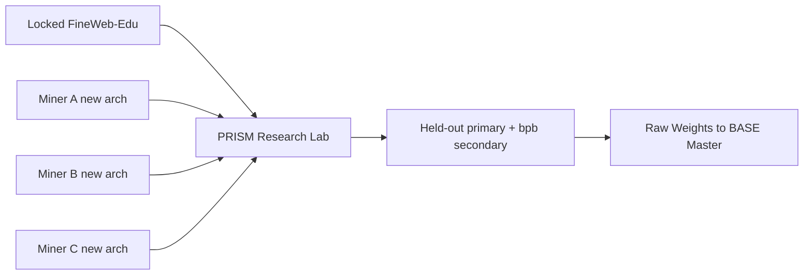

# PRISM Overview

PRISM is a **research lab** machine-learning challenge for BASE Network. The **norm** is to try
**new architectures**. The **goal** is to find **more performant** architectures for our LLM
target — generalization after from-scratch learning under fair challenge-owned re-execution
(data, seed, metrics), not short-train compression alone and not paper claims.

Bittensor miners submit a model and a training procedure as two executable Python scripts. PRISM
competes them on locked FineWeb-Edu data with forced random initialization.

PRISM consumes the immutable Base SDK **v3.1.2**. Admission and scoring are **deterministic**: there is
no LLM hard gate and no master LLM gateway.

## Purpose

PRISM does not ask miners to train a frontier model offline and dump weights. It asks: given a fixed
dataset and a forced random initialization, which architecture and training recipe actually
**learns a better model for us**? Production emission ranks that with held-out / generalization
**primary** and prequential bits-per-byte **secondary**. Multimetric / Complete View publish the
richer scientific vector without silently becoming the emission scalar.

It answers questions like:

- Which novel architectures generalize best from scratch under a fixed compute budget?
- Which training loops (optimizer, schedule, data ordering, distributed strategy) improve sample efficiency?
- Which ideas still win when the validator, not the miner, controls the seed, the data, and the metric?
- Which provisional 124M winners still hold after a 350M promote confirm/revoke?

## Small-first dual ladder (GPU-limited)

| Stage | Param cap | Role |
| --- | ---: | --- |
| Discover / provisional | **124M** (`124_000_000`) | Cheap continuous exploration; **may provisional-crown** emission |
| Promote / final | **350M** (`350_000_000`) | Same package pin re-eval; **confirms or revokes** provisional crown |

Default exploration shapes under 124M: [`examples/tiny-1m`](../examples/tiny-1m) and
[`examples/mamba-tiny`](../examples/mamba-tiny). Novel `nn.Module` families under the AST sandbox
remain expected, not second-class.

## How It Works

1. Miners submit two scripts: a model `architecture.py` and a custom `training.py` loop.
2. BASE verifies miner identity and forwards the submission.
3. PRISM runs a static AST sandbox and **deterministic admission** (project shape, source similarity,
   anti-cheat, dual param ladder). A similarity quarantine is a terminal reject; there is no held-for-review path.
4. The challenge re-executes the loop under a forced random init on the locked FineWeb-Edu train
   split, capturing the online loss stream itself (or, when the worker plane is on, ingests a
   reconciled `ExternalResultEnvelope` only).
5. PRISM computes emission rank: **held-out / generalization primary**, prequential bits-per-byte
   **secondary**, with memorization and step-0 gates fail-closed or stronger.
6. Scores rank on the emission leaderboard; PRISM pushes raw hotkey weights to the BASE master for aggregation.
   Validators fetch the master vector and submit on-chain under their own wallets. Two-tier ownership
   defaults: architecture **0.50** / training **0.50**.

## Who Owns What

The **miner** owns the model and the training procedure, including multi-GPU scaling and novel
architecture design. The **challenge** owns everything that keeps the comparison fair: the dataset
and the secret `val`/`test` splits, the forced seed and deterministic flags, the data order and
single-pass loss capture, and the scoring. Any metric the miner reports and any manifest it writes
are ignored; scoring reads only the challenge-authored `prism_run_manifest.v2.json`.

## Why It Is Cheat-Resistant

- forced random init (fixed seed) makes smuggled pretrained weights inert;
- single-pass, predict-then-train loss has no held-out leakage by construction;
- integrating the whole loss curve defeats single-checkpoint gaming;
- compute normalization (tokens/FLOPs, never wall-clock) means a faster GPU cannot buy a better score;
- a secret held-out split feeds the **emission primary** and the anti-memorization gap;
- deterministic sandbox + similarity + anti-cheat gates run without an LLM.

The emission primary signal is **held-out / generalization** (preferred: held-out delta-over-random-init
on the secret val split; alternate pin may use absolute val bpb). Prequential bits-per-byte remains the
recomputed **secondary** architecture-agnostic compression signal. An excessive train-vs-held-out gap is
penalized as memorization; step-0 anomaly zeroes cheats.

## Emission vs scientific surfaces

| Surface | Purpose | Rank keys |
| --- | --- | --- |
| **Emission crown** | Subnet raw weights / leaderboard | Held-out primary → bpb secondary → anti-overfit residual |
| **Official Comparison / multimetric.v1.1 / Complete View** | Published scientific architecture grade | Multi-axis vector; `TIE_POLAR` / `crown_allowed=false` when axes disagree |

Multimetric and Complete View are **research grade** visibility surfaces. They do **not** silently
replace the emission scalar in volume-1. See [Scoring](scoring.md) and
[Official Comparison](official-comparison.md).

## Runtime Shape

Deploy as a **long-lived Compose challenge service**. Preferred production layout is the BASE master
Compose project with PRISM in **combined mode** (API + in-process queue drain) and digest-pinned
images. Real Lium/Targon TEE production PASS is blocked; local fixtures alone can produce a labeled
`LOCAL-FIXTURE PASS`. See [Architecture](architecture.md), [Security](security.md), and
[Operators](operators.md).

See [Scaling Evaluation](scaling.md) for the multi-GPU contract and budget, [Scoring](scoring.md)
for emission math, and [Official Comparison Protocol v1](official-comparison.md) for the scientific
multi-axis grade (multimetric.v1.1, Complete View, train series residual).
