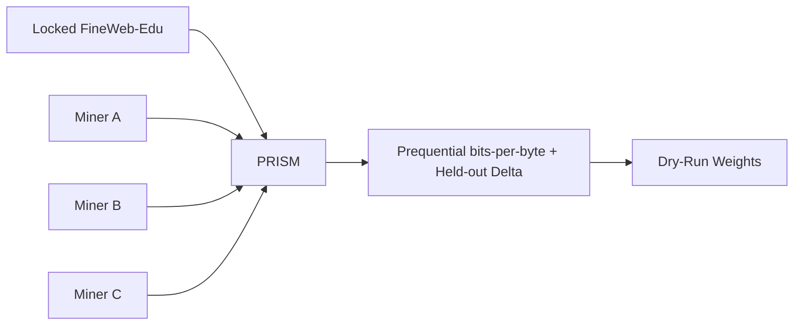

# PRISM Overview

PRISM is an "ability to learn" machine-learning challenge for BASE Network. Bittensor miners submit a
model and a training procedure as two executable Python scripts, and PRISM competes them on how well
their model learns from scratch on locked data.

## Purpose

PRISM does not ask miners to train a frontier model. It asks a sharper question: given a fixed dataset
and a forced random initialization, how quickly does a model learn? PRISM measures that as online
compression: the better a model predicts each new chunk of text *before* training on it, the better it
compresses the stream and the higher it scores.

It answers questions like:

- Which architectures learn fastest from scratch under a fixed compute budget?
- Which training loops (optimizer, schedule, data ordering, distributed strategy) improve sample efficiency?
- Which ideas hold up when the validator, not the miner, controls the seed, the data, and the metric?

## How It Works

1. Miners submit two scripts: a model `architecture.py` and a custom `training.py` loop.
2. BASE verifies miner identity and forwards the submission.
3. PRISM runs a static AST sandbox and an LLM hard gate over both scripts.
4. The validator re-executes the loop under a forced random init on the locked FineWeb-Edu train
   split, capturing the online loss stream itself.
5. PRISM computes a prequential bits-per-byte score with a held-out delta tie-breaker.
6. Scores rank on the leaderboard and convert into normalized, dry-run BASE weights.

## Who Owns What

The **miner** owns the model and the training procedure, including multi-GPU scaling. The **challenge**
owns everything that keeps the comparison fair: the dataset and the secret `val`/`test` splits, the
forced seed and deterministic flags, the data order and single-pass loss capture, and the scoring. Any
metric the miner reports and any manifest it writes are ignored; scoring reads only the
challenge-authored `prism_run_manifest.v2.json`.

## Why It Is Cheat-Resistant

- forced random init (fixed seed) makes smuggled pretrained weights inert;
- single-pass, predict-then-train loss has no held-out leakage by construction;
- integrating the whole loss curve defeats single-checkpoint gaming;
- compute normalization (tokens/FLOPs, never wall-clock) means a faster GPU cannot buy a better score;
- a secret held-out split feeds only the tie-breaker and the anti-memorization gap.

The primary signal is the prequential bits-per-byte: the area under the from-scratch loss curve,
normalized by raw UTF-8 bytes. Faster learners compress better and rank higher; the held-out
delta-over-random-init breaks near-ties, and an excessive train-vs-held-out gap is penalized as
memorization.

See [Scaling Evaluation](scaling.md) for the multi-GPU contract and budget, and [Scoring](scoring.md)
for the math.
