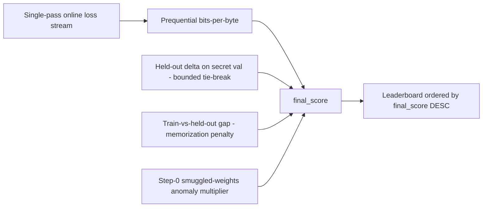

# Scoring and Rewards

PRISM scores one thing: a model's ability to learn from scratch, measured as online compression. For
the **production leaderboard and raw-weight path**, the primary metric is a **prequential
bits-per-byte (bpb)** score the challenge computes itself from a forced-init re-execution; a held-out
delta breaks near-ties and an anti-memorization gap penalizes overfitting. **Lower bits-per-byte is
better** on that path.

> **Official Comparison Protocol v1 ranking invert (+ scorecard v1.1).** The offline
> [Official Comparison](official-comparison.md) surface (**not** this leaderboard) ranks with
> **held-out / generalization as PRIMARY** and prequential bpb as **SECONDARY**. The additive
> multi-metric scorecard annex (`scorecard_id=multimetric.v1.1`) publishes validity,
> short-gen, long-ctx, sample-efficiency, memorization, multi-seed, efficiency, and stability
> fields and applies **`TIE_POLAR`** / `crown_allowed=false` when short-gen vs long-ctx disagree.
> When axes do not polar-conflict, the default Official Comparison winner stays the v1 heldout
> primary rule. Do not apply “bpb primary” language from this page to Official Comparison
> headlines, and do not treat the scorecard multi-metric vector as emission ranking. Emission
> weights still follow the leaderboard path below unless a separate product mode says otherwise.
> Prior LAB-GPU K=1 short-ctx wins are **provisional only**; REAL-PROVIDER TEE remains orthogonal
> and **BLOCKED**.


## Leaderboard Primary Metric: Prequential Bits-Per-Byte

During the re-execution, the challenge feeds the model fresh, single-pass batches from the locked train
split and records its loss on each new batch **before** the optimizer updates on it. Single-pass data
makes this online (predict-then-train) loss the prequential code-length by construction. The challenge
integrates that code-length and normalizes it by the raw UTF-8 bytes covered:

```text
bpb = (sum over consumed tokens of -log2 p(token)) / total_bytes_covered
```

Byte normalization makes the metric **tokenizer-agnostic** (any tokenizer compares like for like);
integrating the whole curve defeats single-checkpoint gaming; scoring each token before training on it
removes held-out leakage by construction; and forced random init makes smuggled pretrained weights
inert.

`final_score` is a documented monotone-decreasing transform of bpb, so a **lower** bpb yields a
**better** (higher) `final_score` and the leaderboard's `ORDER BY final_score DESC` ranks better
learners first:

```text
final_score = 1 / (1 + bpb)        # before tie-break, penalty, and anti-cheat multiplier
```

## Compute Normalization, Not Wall-Clock

The score is **compute-normalized**: normalized by tokens consumed (and optionally estimated FLOPs),
never by wall-clock time. A faster GPU or more GPUs cannot buy a better score; wall-clock is only a
safety cap. This keeps scores fair across the 1-to-8 GPU range even though the scored run uses one
physical GPU.

## Leaderboard Tie-Breaker: Held-Out Delta Over Random Init

For near-equal bpb on the **leaderboard**, the challenge breaks the tie with the held-out delta on
the secret `val` split:

```text
heldout_delta = bpb(random-init twin on val) - bpb(trained model on val)
```

A larger improvement over the random-init twin is better. The held-out delta is folded into
`final_score` as a **bounded** tie-break term: it can only reorder submissions whose bpb is within a
small epsilon, so a strictly lower bpb is never ranked worse on the leaderboard primary axis. With no
secret val split scored, the run is graded on bpb alone.

On the **Official Comparison** surface the ranking axes invert: held-out becomes the ranking
primary and prequential bpb becomes secondary
([Official Comparison Protocol v1](official-comparison.md)). The multi-metric scorecard annex
v1.1 (`multimetric.v1.1`) adds the A→Z scientific vector and mandatory **TIE_POLAR** when short
held-out and long-context axes disagree beyond ε; it does **not** change this leaderboard path.
## Anti-Memorization Gap

The challenge measures the train-vs-held-out gap (converged train bpb vs held-out val bpb on the same
byte basis). An excessive gap flags memorization and multiplies a penalty into `final_score`, so a
memorizer ranks below an equivalent non-memorizing learner. The comparison is basis-consistent so a
benign learner is not falsely flagged.

## Anomaly Zeroing

A step-0 / smuggled-weights anomaly (an impossibly low initial loss under forced random init) drives the
anti-cheat multiplier to zero, so an anomalously good bpb is zeroed rather than rewarded. A degenerate
run (zero coverage, non-finite, or out-of-band bpb) is failed rather than scored.

## Leaderboard And Weights

The leaderboard ranks by `final_score` (bpb plus the folded-in held-out delta). Remaining ties break by
**earliest-commit-wins**, then submission id, for a total, reproducible order. Each hotkey appears at
most once, keeping its best submission. PRISM converts completed scores into raw hotkey weights and
**pushes** them to the BASE master for aggregation. `get_weights` remains available for inventory/
compatibility. On-chain `set_weights` is validator-owned only; PRISM never writes weights on-chain.

## Source Of Truth

Every number above is recomputed by the challenge from the challenge-authored
`prism_run_manifest.v2.json`. Miner-reported metrics and miner-written manifests are ignored. The legacy
raw-loss term and the v1-NAS architecture/training ownership pools are retired from the score.

Miner self-reports remain non-authoritative on both the leaderboard path and Official Comparison
mode (including scorecard v1.1). REAL-PROVIDER TEE labels are orthogonal to ranking: see
[Official Comparison](official-comparison.md) § TEE honesty / scorecard non-claims and
[Security](security.md).
## Reference Studies

- **Prequential / online coding** — Dawid, 1984: score the integrated predict-then-train loss, not a
  final checkpoint.
- **Minimum description length** — Rissanen, 1978: treat compression (code-length) as the learning
  signal.
- **Scaling laws** — Kaplan et al., 2020: compare loss trajectories under matched compute.
- **Compute-optimal scaling** — Hoffmann et al., 2022: normalize by tokens/compute so under- or
  over-trained regimes do not skew ranking.
- **Dataset provenance** — Penedo et al., 2024 (*The FineWeb Datasets*): freeze the data revision and
  shards for reproducible official runs.
