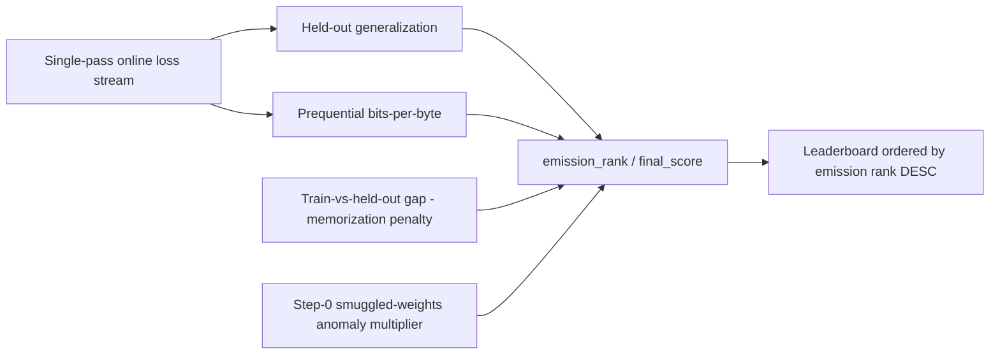

# Scoring and Rewards

PRISM is a **research lab**. The emission path scores one thing: which package produces a **better
model for us** after fair from-scratch learning — measured first by **held-out / generalization**,
then by recomputed prequential **bits-per-byte**. The challenge owns every number.

> **Surface honesty (locked).**
>
> | Surface | Role | Ranking |
> | --- | --- | --- |
> | **Emission crown** (this page: leaderboard → raw weights) | Subnet reward eligibility | **Held-out / generalization PRIMARY**, prequential bpb **SECONDARY** (Official-like invert) |
> | **Official Comparison / multimetric.v1.1 / Complete View** | Published **scientific miner architecture grade** | Multi-axis vector + polar honesty; **not** the emission scalar in v1 |
>
> Do **not** claim multimetric / Complete View silently replaces emission. Prior LAB-GPU K=1 short-ctx
> wins remain **provisional only**. Challenge-owned **`prism_train_series.v1`** is visibility + residual
> densify for sample-eff/stability only — **never sole primary** over held-out/bpb. When an Official
> grade pin **requires** the series and it is missing/corrupt, Official grade **fail-closes** (not
> silent PASS); miner dashboards remain non-authoritative. Provider trust + **IMAGE_PIN** govern
> worker integrity; **REAL-PROVIDER TEE** is **retired** for Prism product (historical tables may
> still say BLOCKED; never a production scoring gate).


## Emission Primary: Held-Out / Generalization

For the **production leaderboard and raw-weight path**, the ranking primary is **held-out /
generalization** quality the challenge computes itself on the secret `val` split after forced-init
re-execution.

Preferred primary form (higher better):

```text
heldout_delta = bpb(random-init twin on val) - bpb(trained model on val)
```

Alternate pin option: absolute `val_bpb_trained` (lower better) when twin delta is unavailable.
Honestly lower held-out free energy (or larger honest improvement over the random-init twin) ranks
higher. A train-only memorizer must not win the emission crown on primary.

With multi-seed residual when configured:

```text
primary_S = mean_k heldout_delta(S; seed_k)     # higher better
```

(or the documented alternate mean of `val_bpb_trained`, lower better).

`final_score` / emission rank folds held-out primary first, then secondary bpb, then
anti-memorization and step-0 multipliers, so the leaderboard's descending order ranks better
generalizing learners first.

Emission scoring is **architecture-agnostic**: the same fold runs for every admitted
`nn.Module` that clears AST + dual param ladder. There are **no family-specific emission
shortcuts** (Transformer / pure-torch SSM / looped-depth / novel hybrids receive the same
held-out primary + bpb secondary path). Lab seeds `tiny-1m` and `mamba-tiny` are default
exploration shapes only — not privileged emission families.

## Emission Secondary: Prequential Bits-Per-Byte

During the re-execution, the challenge feeds the model fresh, single-pass batches from the locked train
split and records its loss on each new batch **before** the optimizer updates on it. Single-pass data
makes this online (predict-then-train) loss the prequential code-length by construction. The challenge
integrates that code-length and normalizes it by the raw UTF-8 bytes covered:

```text
bpb = (sum over consumed tokens of -log2 p(token)) / total_bytes_covered
```

Byte normalization makes the metric **tokenizer-agnostic** (any tokenizer compares like for like);
integrating the whole curve defeats single-checkpoint gaming; scoring each token before training on it
removes held-out leakage by construction; and forced random init makes smuggled pretrained weights
inert.

**Lower bits-per-byte is better** as the **secondary** emission axis. When held-out is within a small
epsilon (near-tie on primary), prequential bpb breaks the tie so a strictly better recomputed
compression signal can reorder near neighbors — but a clearly better held-out winner is not
overturned by bpb alone.

Continuity transform (still used where products report a scalar display fold of bpb before penalty):

```text
bpb_display = 1 / (1 + bpb)        # higher display = lower bpb; secondary only under emission rank
```

## Compute Normalization, Not Wall-Clock

The score is **compute-normalized**: normalized by tokens consumed (and optionally estimated FLOPs),
never by wall-clock time. A faster GPU or more GPUs cannot buy a better score; wall-clock is only a
safety cap. This keeps scores fair across the 1-to-8 GPU range even though the scored run uses one
physical GPU.

## Dual param ladder (explore → promote)

Emission crowns respect the **GPU-limited small-first ladder**:

| Stage | Cap | Crown role |
| --- | ---: | --- |
| Explore / provisional | **124M** | Qualifying scores may **provisional-crown** architecture or training pools |
| Promote / final | **350M** | Same package/family pin re-eval **confirms or revokes** the provisional crown |

Explore is the default thrash size. Durable supremacy requires promote confirmation; a failed or
losing promote revokes the provisional crown so dead provisional winners do not keep emission weight.

## Anti-Memorization Gap

The challenge measures the train-vs-held-out gap (converged train bpb vs held-out val bpb on the same
byte basis). An excessive gap flags memorization and multiplies a penalty into the emission score, so a
memorizer ranks below an equivalent non-memorizing learner. The comparison is basis-consistent so a
benign learner is not falsely flagged.

## Anomaly Zeroing

A step-0 / smuggled-weights anomaly (an impossibly low initial loss under forced random init) drives the
anti-cheat multiplier to zero, so an anomalously good looking compression curve is zeroed rather than
rewarded. A degenerate run (zero coverage, non-finite, or out-of-band bpb) is failed rather than scored.

## Leaderboard And Weights

The emission leaderboard ranks by held-out-primary emission rank (with bpb secondary and folded
penalties). Remaining ties break by **earliest-commit-wins**, then submission id, for a total,
reproducible order. Each hotkey appears at most once, keeping its best submission.

PRISM converts completed scores into raw hotkey weights and **pushes** them to the BASE master for
aggregation. Two-tier ownership defaults are architecture **0.50** / training **0.50** (no silent
0.60/0.40 or 0.65/0.35 drift on defaults). Both tiers consume the **same emission rank metric**.
`get_weights` remains available for inventory/compatibility. On-chain `set_weights` is validator-owned
only; PRISM never writes weights on-chain.

## Scientific surfaces (not emission scalar)

Offline [Official Comparison](official-comparison.md) is the **scientific miner architecture grade**:
multi-axis Official / Complete View with held-out primary, bpb secondary, long-ctx, reasoning, and
polar honesty (`TIE_POLAR` / `crown_allowed=false` when axes disagree). The additive multimetric
scorecard annex (`scorecard_id=multimetric.v1.1`) and Complete View publish the scientific vector.
They remain **published research grade** and do **not** silently replace this emission crown path in
volume-1 (a future phase may fold axes into emission only with an explicit product bump).

Challenge-owned **`prism_train_series.v1`** time-flow (loss/bpb + mandatory `grad_norm` / clip when
instrumented) densifies sample-eff/stability residual and operator visibility. Series must **never
sole-rank** mining packages over Official held-out or recomputed bpb axes, and must **not**
substitute emission held-out primary.

## Source Of Truth

Every number above is recomputed by the challenge from the challenge-authored
`prism_run_manifest.v2.json`. Miner-reported metrics and miner-written manifests are ignored. The legacy
raw-loss term and the v1-NAS architecture/training ownership pools are retired from the score.

Miner self-reports remain non-authoritative on both the emission path and Official Comparison mode
(including scorecard v1.1, Complete View, and train series). Provider-trust / IMAGE_PIN / LAB-GPU
labels are orthogonal to ranking; **REAL-PROVIDER TEE** is a retired product goal (historical
non-claims only): see [Official Comparison](official-comparison.md) §17 train series telemetry,
scorecard honesty, and [Security](security.md).

## Reference Studies

- **Prequential / online coding** — Dawid, 1984: score the integrated predict-then-train loss, not a
  final checkpoint.
- **Minimum description length** — Rissanen, 1978: treat compression (code-length) as the learning
  signal.
- **Scaling laws** — Kaplan et al., 2020: compare loss trajectories under matched compute.
- **Compute-optimal scaling** — Hoffmann et al., 2022: normalize by tokens/compute so under- or
  over-trained regimes do not skew ranking.
- **Dataset provenance** — Penedo et al., 2024 (*The FineWeb Datasets*): freeze the data revision and
  shards for reproducible official runs.
- **Generalization over train compression** — held-out primary emission prefers architectures that
  actually improve secret val free energy under matched train budgets.
